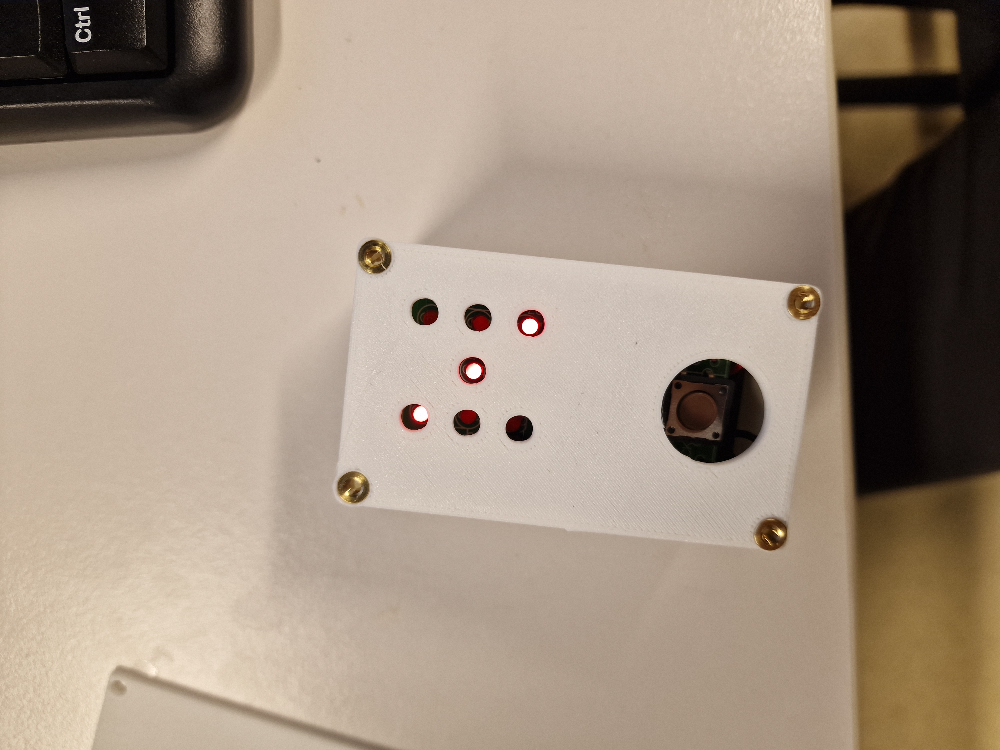

# Assignment 2 - IN5590

The aim for assignment 2 is to learn how to solder
and get more experience in CAD and 3D-printing.

## Task 1) Solder electronics

In the lab session you can select between the following soldering kits: 

- [Electronic Dice Kit](https://www.elfadistrelec.no/en/electronic-dice-kit-velleman-wsg113/p/18520090)
- [Metal detector kit](https://www.elfadistrelec.no/en/metal-detector-kit-velleman-wsmi7102/p/18500093)
- [Rolling Clock Kit](https://www.elfadistrelec.no/en/rolling-clock-kit-velleman-wst123/p/18520223)
- [Electronic Decision Maker Kit](https://www.elfadistrelec.no/en/electronic-decision-maker-kit-velleman-wsg135/p/18500159)

We recommend training to solder on Sonens soldering training kits, before starting on the kits mentioned above.

You will get to keep the kit handed out, however you will only get **one**. If you 
for some reaseon break the kit, you can get another to be able to finish the 
assignment, but you will not get to keep it. 

We only have 5 of each mentioned kit. The kits will be handed out in the first come first served priority.

Make a GIF that shows the kit working. the GIF should:

- Not be more than 10 seconds long.
- Not be more than 25MB.
- Be 1:1 ratio.

FFmpeg can help you with the enlisted reqiurements. Here is a starting point:

```
ffmpeg -i IMG_4730.MOV -t 10s -vf 'crop=600:600' -r 15  output/1.gif
```

[](./output/1.gif)

**Deliverable:** `1.gif` in the `./output/` directory.

## Task 2) Make a custom box for the soldering kit

Make a box that protects the electronics from dust and damage, while preserving the 
possibility to use the kit as intended. E.g:

- The buttons should be available.
- The LEDs should be visable.
- The battery should be swapable. 

You can use both 3D-printing and lasercutting to acheive this.

Add all the SolidWorks files in the `output` directory. 

Take a photo of the final product with the name `2.png`.

[](./output/2.png)

**Deliverable:** `2.png` and the SolidWorks files in the `./output/` directory.
